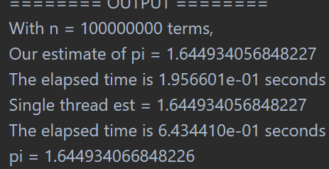
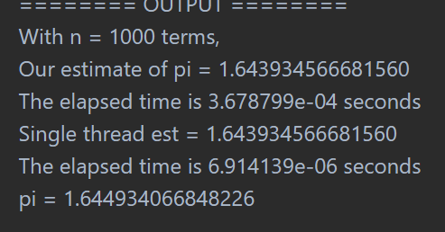
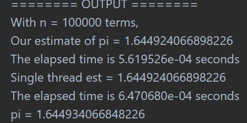
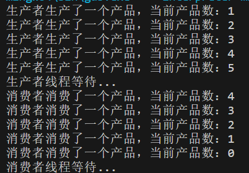
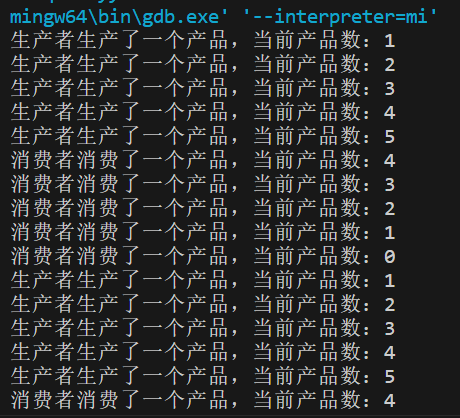
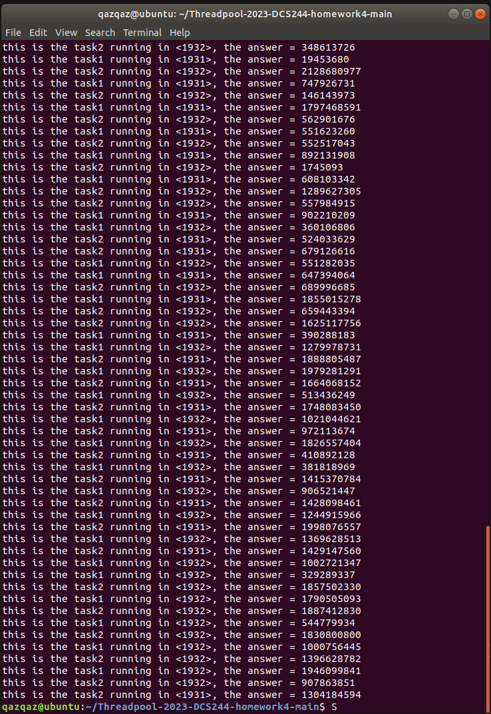

# 超算作业pthread库编程

姓名:杨子昂  学号:21307181

### 一.实验题目

pthread编程

### 二.实验内容

#### 1.欧拉公式

请使用pthread中的semaphore计算π26的值。
下面是我需要添加的代码的部分

```
void* Thread_sum(void* rank) {
    long long  my_rank = (long long) rank;
    long double my_sum = 0.0;
    long long i;
    long double factor;
    long long my_n = n / thread_count;
    long long my_first_i = my_n * my_rank + 1;
    long long my_last_i = my_first_i + my_n - 1;

    for (i = my_first_i; i <= my_last_i; i++) {
       factor = 1.0 / (i * i);
       my_sum += factor;
    }

    sem_wait(&sem);
    sum += my_sum;
    sem_post(&sem);

    return NULL;
}
```

需要我们填写的多线程计算pi值的部分。这一部分和之前的MPI编程很像，都是要对每一个线程去分配他所要计算的范围。在这个函数中，my_sum是每个线程用来保存自己的计算结果变量。factor是用来计算每次循环的值，并逐步向my_sum里进行叠加的。mv_n是计算每个线程需要计算的区间长度。my_first_i和my_last_i是每个线程计算区间的两个端点。
在每个线程计算完自己的my_sum之后需要将它汇总到全局的sum里面，这个时候就涉及到了对于共享内存的访问互斥的问题，我们使用信号量来实现互斥锁。在加前先sem_wait来获取锁，加上后用sem_post释放锁即可。以下是实验结果：


接下来分析加速比随n变化的关系。首先明确n的定义，n是欧拉公式需要算到哪一步。也可以认为是这个多线程编程的输入规模。我们分别测试了1000，100000，10000000三种的规模输入。






通过这三张图，我们可以计算每张图的加速比。加速比在这三种输入规模下的数值从0.03到1.3到3.0越来越大。其内部原因也比较容易想到，由于在这个程序中我们的线程数是固定的，且每个线程都会参与计算，因此在任务量n比较小的时候，即使线程很多，但是不同线程之间的调度也需要时间，因此调度算法所花的时间在小任务量的情况下是远远大于并行计算的时间的。因此加速比会很小。当任务量增多的时候，调度算法所消耗的时间相比于并行计算带来的收益会越来越小，因此多线程的计算优势开始显现，所以加速比会逐渐提升。

#### 2.生产者消费者问题

1.补充代码

```
pthread_cond_t cond_prod = PTHREAD_COND_INITIALIZER;//生产者条件变量
pthread_cond_t cond_cons = PTHREAD_COND_INITIALIZER;//消费者条件变量

void *produce(void *args)
{
    int i;
    for (i = 0; i < NUMS; i++) {
        pthread_mutex_lock(&mylock);
        while (capacity == CAPACITY) { // 缓冲区满了，等待消费者消费
            printf("生产者线程等待...\n");
            pthread_cond_wait(&cond_prod, &mylock);
        }
        capacity++;
        printf("生产者生产了一个产品，当前产品数：%d\n", capacity);
        pthread_cond_signal(&cond_cons);//通知消费者可以消费了
        pthread_mutex_unlock(&mylock);
    }
    return NULL;
}

void *consume(void *args)
{
    int i;
    for (i = 0; i < NUMS; i++) {
        pthread_mutex_lock(&mylock);
        while (capacity == 0) { // 缓冲区空了，等待生产者生产
            printf("消费者线程等待...\n");
            pthread_cond_wait(&cond_cons, &mylock);
        }
        capacity--;
        printf("消费者消费了一个产品，当前产品数：%d\n", capacity);
        pthread_cond_signal(&cond_prod);//通知生产者可以生产了
        pthread_mutex_unlock(&mylock);
    }
    return NULL;
}
```

这是生产和消费两个函数
他们运行起来的效果是这个样子的：


其实输出有很多，但都是上面这张图片的循环。
2.改进代码，解决饥饿。
我们将刚才的生产函数和消费函数进行一定的修改。增加了两个信号量。一个是empty，另一个是full，也就是我们熟悉的PV操作。

```
pthread_cond_t cond_prod = PTHREAD_COND_INITIALIZER;//生产者条件变量
pthread_cond_t cond_cons = PTHREAD_COND_INITIALIZER;//消费者条件变量
sem_t empty, full;

void *produce(void *args)
{
    int i;
    for (i = 0; i < NUMS; i++) {
        sem_wait(&(empty));
        pthread_mutex_lock(&mylock);
        while (capacity == CAPACITY) { // 缓冲区满了，等待消费者消费
            printf("生产者线程等待...\n");
            pthread_cond_wait(&cond_prod, &mylock);
        }
        capacity++;
        printf("生产者生产了一个产品，当前产品数：%d\n", capacity);
        pthread_cond_signal(&cond_cons);//通知消费者可以消费了
        pthread_mutex_unlock(&mylock);
        sem_post(&full);
    }
    return NULL;
}

void *consume(void *args)
{
    int i;
    for (i = 0; i < NUMS; i++) {
        sem_wait(&(full));
        pthread_mutex_lock(&mylock);
        while (capacity == 0) { // 缓冲区空了，等待生产者生产
            printf("消费者线程等待...\n");
            pthread_cond_wait(&cond_cons, &mylock);
        }
        capacity--;
        printf("消费者消费了一个产品，当前产品数：%d\n", capacity);
        pthread_cond_signal(&cond_prod);//通知生产者可以生产了
        pthread_mutex_unlock(&mylock);
        sem_post(&empty);
    }
    return NULL;
}
```

在函数外面，我们定义了empty和full两个信号量，用进行缓冲区满和空两种情况的特判，从而避免产生饥饿的情况。下面是改进之后的输出。



#### 3.线程池

下面是线程池的代码

```
#include "threadpool.h"

threadpool* Pool_init(int Maxthread)
{

	threadpool* pool;
	pool = (threadpool*)malloc(sizeof(threadpool));

	pool->flag = 1;


	/*******************************************************************/

    pool->poolhead = NULL;
    pool->jobnum = 0;
    pool->Maxthread = Maxthread;
	pool->threads = (pthread_t*)malloc(sizeof(pthread_t) * Maxthread);
    for(int i = 0; i < Maxthread; ++i)
    {
        if(pthread_create(&pool->threads[i], NULL, (void*)Job_running, pool))
        {
            perror("pthread_create");
            exit(-1);
        }
    }
    sem_init(&(pool->sem), 0, 1); //初始化互斥信号量
    sem_init(&(pool->empty),0,Maxthread);
    sem_init(&(pool->full),0,0);

   	/******************************************************************/

	return pool;
}

void Job_running(threadpool* pool)
{
	while(pool->flag){
        if(pool->flag == 0 || pool->jobnum == 0)pthread_exit(NULL);
	/*******************************************************************/

      // 等待信号量，即等待任务的到来


	// 取出任务队列中的一个任务节点
	Jobnode job = Pop(pool);

	// 执行任务
    //if(job.pf != NULL){
	job.pf(job.arg);

	// 删除任务节点
	free(job.arg);
    //}

 
   	/******************************************************************/
	}
	pthread_exit(0);
}


int Add_job(threadpool* pool , function_t pf , void* arg)
{
	/*******************************************************************/

    Jobnode newnode;
    newnode.pf = pf;
    newnode.arg = arg;
    if(Push(pool, newnode)==-1)
    {
        return -1;
    }
      // 将新任务节点加入到任务队列中

 // 唤醒一个线程去处理任务

    return 0;

   	/******************************************************************/
}

int Push(threadpool* pool , Jobnode data )
{
	/*******************************************************************/

    //等待直到有空闲的位置
  
    sem_wait(&(pool->empty));
    //获取锁，保证线程安全
    sem_wait(&(pool->sem));
    //判断任务队列是否已满
    if(pool->jobnum == pool->Maxthread)
    {
        //释放锁
        sem_post(&(pool->sem));
        //释放一个空闲位置信号量
        sem_post(&(pool->empty));
        return -1;//队列如果为满则返回错误
    }
    //创建新的任务节点
    threadjob* cur = (threadjob*)malloc(sizeof(threadjob));

    cur->data = data;
    cur->next = NULL; 
    //将新的任务节点添加到队列中
    if(pool->poolhead == NULL) 
    {
        //如果poolhead为空则直接创建
        pool->poolhead = cur;
    }
    else 
    {
        threadjob* head = pool->poolhead;
        while(head->next) 
        {
            head = head->next;
        }
        head->next = cur;
    }
    pool->jobnum ++ ;
  
    //释放锁和一个空闲位置信号量
    sem_post(&(pool->sem));
    sem_post(&(pool->full));
    return 1;

   	/******************************************************************/
}

Jobnode Pop(threadpool* pool)
{
	/*******************************************************************/

    threadjob* job;
    Jobnode empty_job = {NULL, NULL};
    sem_wait(&(pool->full));
    sem_wait(&(pool->sem));
    if(pool->poolhead == NULL) {
        sem_post(&(pool->sem));
        sem_post(&(pool->full));
        return empty_job;
    }
    job = pool->poolhead;
    pool->poolhead = job->next;
    Jobnode node = job->data;
    free(job);
    pool->jobnum--;
    sem_post(&(pool->sem));
    sem_post(&(pool->empty));
   
    return node;

   	/******************************************************************/
}

int Delete_pool(threadpool* pool)
{

	pool->flag = 0;
	/*******************************************************************/
    //sem_post(&(pool->sem));
    sem_destroy(&(pool->sem));
    sem_destroy(&(pool->empty));
    sem_destroy(&(pool->full));
  
    // 删除任务队列中的任务节点
    threadjob* curjob = pool->poolhead;
    while(curjob!=NULL) {
        threadjob* nextjob = curjob;
        curjob = curjob->next;
        free(nextjob->data.arg);
        free(nextjob);
    }

    // 等待所有线程结束
    for(int i = 0; i < pool->Maxthread; ++i) {
        pthread_join(pool->threads[i], NULL);
    }

    // 释放线程池和信号量所占的空间
    free(pool->threads);

    free(pool);

    return 0;

   	/******************************************************************/

}

```

这里是包含了所有需要我们实现的对于线程池的维护的函数。
首先来看Pool_init函数，这个是整个线程池的初始化函数，除了对线程池里的一些基本的量的初始化，还有有个信号量，empty和full这两个信号量是用来进行PV操作的，可以看成是对任务满和任务空两种情况的特殊判断，避免饥饿的产生。

Job_running函数中也有注意的点，即使pool->flag为true，也需要在判断pool->jobnum是否等于0，避免在jobnum为0的时候执行pop函数出现错误，从而无法进入最后的delete函数。

Add_job函数很简单，创建一个新的Jobnode对象，push进去即可。

Push函数：首先尝试获取empty和sem两个信号量，如果任务量已满就需要复原信号量。然后分配threadjob内存，将data存在threadjob里。释放sem信号量，但这时候因为是往任务队列里面新加入一个任务，所以释放的是full信号量。

Pop函数的信号量释放和Push函数对称的，开始的时候要获取sem和full的锁。如果任务队列里面没有需要执行的任务，就把获取到锁复原。当完成pop操作后，也需要对称的将sem和empty信号量释放。

Delete_pool函数，要注意需要一个一个的删除任务队列和释放空间。并将每个线程显式的结束掉

下面是实验结果

